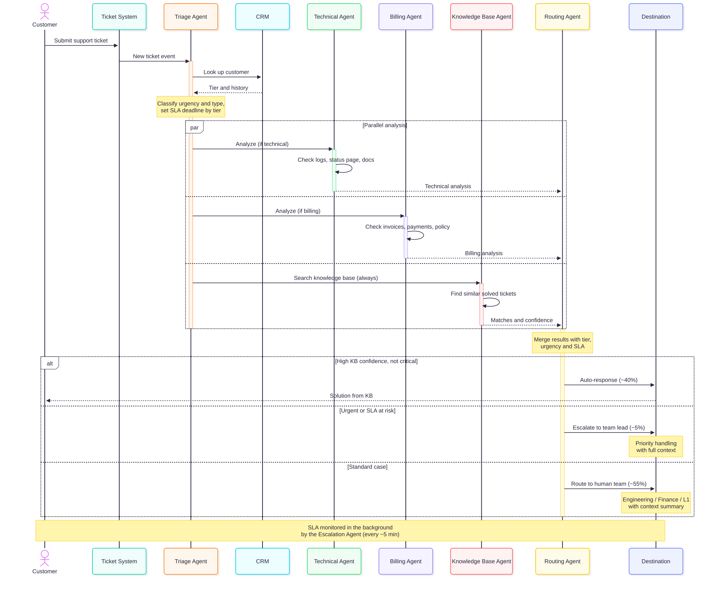

# Customer Support Ticket Routing System Architecture

Design a multi-agent system for intelligent customer support ticket handling.

## Problem Statement

Your SaaS company receives 5,000+ support tickets daily across email, chat, and web forms. Current process:
- All tickets go to L1 support
- Manual categorization and routing
- Average response time: 4 hours
- Enterprise SLA: 1 hour (frequently missed)

**Goal**: Intelligent system that automatically triages, routes, and resolves tickets.

---

## Requirements Analysis

### Functional Requirements
- Triage tickets by urgency and complexity
- Route technical issues to engineering
- Route billing issues to finance
- Prioritize by customer tier (enterprise vs. standard)
- Search knowledge base for similar solved issues
- Auto-respond to common questions
- Escalate unresolved issues to humans with context

### Non-Functional Requirements
- Enterprise SLA: < 1 hour response
- Standard SLA: < 4 hour response
- Handle 5,000+ tickets/day
- 95% routing accuracy
- Audit trail for all decisions

---

## Option A: Single Agent Approach


### Pros
- Simple implementation
- Single context (all info in one place)
- Easy to debug

### Cons
- Sequential processing (slow)
- Can't handle parallel tickets efficiently
- One agent doing too many things
- Hard to specialize for different ticket types

### Estimated Performance
- Processing time: 30-60 seconds per ticket
- Daily capacity: ~2,500 tickets (with queuing)
- SLA compliance: ~70%

---

## Option B: Multi-Agent Approach (Recommended)

##: 1
Agent: Triage
Single purpose: Entry point. Classifies urgency, type (technical, billing, or general), and complexity. Looks up customer
tier and sets the SLA deadline.
Tools: CRM lookup, ticket system (read)
Model: Haiku
Runs: First, sequential
────────────────────────────────────────
#: 2
Agent: Technical
Single purpose: Diagnoses technical issues, forms a root-cause hypothesis, and drafts a fix or next step.
Tools: Logs/monitoring, status page, product docs, ticket history
Model: Sonnet
Runs: Parallel, only if the ticket is technical
────────────────────────────────────────
#: 3
Agent: Billing
Single purpose: Checks invoices, payments, sublity against policy.
Tools: Billing/payments API (read-only), policy docs
Model: Haiku
Runs: Parallel, only if the ticket is billing-related
────────────────────────────────────────
#: 4
Agent: Knowledge Base
Single purpose: Finds similar solved tickets and relevant articles, and drafts a candidate reply with a confidence score.
Tools: KB semantic search, resolved-ticket sea
Model: Haiku
Runs: Parallel, always
────────────────────────────────────────
#: 5
Agent: Routing
Single purpose: Merges everything from agents ecides the final destination and writes a
context summary for any human.
Tools: Ticket system (write), team queues, email/chat send
Model: Sonnet
Runs: After the parallel stage
────────────────────────────────────────
#: 6
Agent: Escalation
Single purpose: Background SLA monitor. Every kets and escalates when time remaining drops
below a threshold.
Tools: Ticket system, Slack/email alerts
Model: Haiku
Runs: Independent, scheduled


<!-- TODO: Design your multi-agent architecture here -->

<!--
INSTRUCTIONS:
1. Design 4-6 specialized agents (Triage, Technical, Billing, Knowledge Base, Routing, Escalation)
2. Create a Mermaid diagram showing:
   - All agents and their relationships
   - Incoming ticket flow
   - Parallel execution paths
   - Final destinations (auto-response, human team, escalation)
3. Use the demo ARCHITECTURE.md as reference for Mermaid syntax
4. Use different colors for different agent types (see demo for style examples)
-->

> **Your task:** Fill in [`diagrams/multi-agent.mmd`](diagrams/multi-agent.mmd), then render:
> ```bash
> mmdc -i diagrams/multi-agent.mmd -o diagrams/multi-agent.svg
> ```



### Agent Definitions

| Agent | Responsibility | Tools | Model | Parallel? |
|-------|---------------|-------|-------|-----------|
| Triage | Entry point. Classifies urgency, type (technical, billing, general) and complexity; looks up customer tier and sets the SLA deadline | CRM lookup, Ticket System (read) | Haiku | No. Runs first, sequential |
| Technical | Diagnoses technical issues, forms a root-cause hypothesis and drafts a fix or next step | Logs/monitoring, status page, product docs, ticket history | Sonnet | Yes. Only if the ticket is technical |
| Billing | Checks invoices, payments, subscription and refund eligibility against policy | Billing/payments API (read-only), policy docs | Haiku | Yes. Only if the ticket is billing-related |
| Knowledge Base | Finds similar solved tickets and relevant articles; drafts a candidate reply with a confidence score | KB semantic search, resolved-ticket search | Haiku | Yes. Always runs |
| Routing | Merges all agent output with customer tier and SLA, decides the final destination and writes a context summary for humans | Ticket System (write), team queues, email/chat send | Sonnet | No. Runs after the parallel stage |
| Escalation | Background SLA monitor. Checks open tickets every ~5 minutes and escalates when time remaining is low | Ticket System, Slack/email alerts | Haiku | Independent. Scheduled background job |

**Orchestration pattern:** Triage runs first, then Technical, Billing and Knowledge Base run in parallel (Technical and Billing only when relevant, so a mixed ticket can trigger both), then Routing merges the results and picks a destination. Escalation runs separately on a schedule.

**Destinations:** Auto-response (~40%), Human Team (~55%) and Escalation (~5%).

<!--
HINTS:
- Triage Agent: Entry point, categorizes tickets, looks up customer
- Technical Agent: Analyzes technical issues if ticket is tech-related
- Billing Agent: Handles payment/account issues if billing-related
- Knowledge Base Agent: Always runs, searches for existing solutions
- Routing Agent: Makes final routing decision based on all analysis
- Escalation Agent: Optional background agent for SLA monitoring
-->

### Pros

- **Meets the enterprise SLA**: Technical, Billing and Knowledge Base run in parallel, so latency is that of the slowest agent, not the sum of all three
- **Better quality per task type**: each agent has one focused prompt and its own tools instead of one crowded context
- **Lower cost**: Haiku handles high-volume simple work (Triage, Billing, KB, Escalation); Sonnet is used only for Technical and Routing
- **Scales to 5,000+ tickets/day**: tickets are independent, and each agent type can be scaled separately
- **Auditable decisions**: only the Routing agent decides, and each specialist leaves a clear output, giving an audit trail
- **Easy to extend**: a new agent (e.g. Security or Account Access) plugs into the parallel stage without rewriting the others
- **Independent SLA safety net**: the Escalation agent runs on its own schedule, so a slow or failed pipeline can't stop SLA breaches from being caught
- **Isolated failures and testing**: if one specialist times out, Routing can still decide with what it has, and each agent can be tested on its own
- **Human handoff with context**: Routing writes a summary so the human team doesn't start from scratch

### Cons

- **Coordination complexity**: more moving parts (parallel stage, merge logic, retries) than a single agent
- **More API calls per ticket**: up to four model calls plus background checks, so higher token cost and more rate-limit pressure
- **Merge and conflict handling**: Routing must reconcile overlapping or contradictory outputs from Technical, Billing and KB
- **Harder debugging**: a wrong decision can come from any agent or from the merge, so tracing needs per-agent logging
- **Context loss between agents**: each specialist sees only what Triage passes on, so a weak Triage result degrades everything after it
- **Single points of failure**: Triage and Routing are mandatory, so an outage in either stops the whole pipeline
- **Misclassification risk**: a wrong type from Triage can skip the right specialist (e.g. a billing issue missed)
- **Upfront effort**: more prompts, tools and integrations to build, test and maintain

### Estimated Performance

- Processing time: 15-25 seconds per ticket (Triage ~3s, parallel stage ~10-15s limited by the slowest agent, Routing ~3-5s)
- Daily capacity: 5,000+ tickets (parallel pipelines, scales horizontally)
- Auto-resolution rate: ~40% handled by auto-response
- SLA compliance: ~95% (enterprise tickets prioritized, Escalation agent as safety net)

*Estimates based on typical model latencies; to be validated with load testing.*

---

## Workflow Diagram

<!-- TODO: Create a detailed workflow diagram showing ticket flow from start to finish -->

<!--
INSTRUCTIONS:
1. Use Mermaid flowchart syntax
2. Show the complete ticket journey:
   - START: New ticket received
   - TRIAGE: Agent categorizes and looks up customer
   - PARALLEL: Multiple agents analyze simultaneously
   - ROUTING: Decision logic for final destination
   - DESTINATIONS: Auto-response, human team, escalation
3. Include decision points (alt/else conditions)
4. Use notes to explain key steps
5. Refer to the demo's workflow diagram for structure
-->

> **Your task:** Fill in [`diagrams/workflow.mmd`](diagrams/workflow.mmd), then render:
> ```bash
> mmdc -i diagrams/workflow.mmd -o diagrams/workflow.svg
> ```


### Sequence Diagram

<!-- TODO: Create a sequence diagram showing the interaction timeline -->

<!--
INSTRUCTIONS:
1. Use Mermaid sequenceDiagram syntax
2. Show actors and participants:
   - actor Customer
   - participant System (Ticket System)
   - participant Triage Agent
   - participant CRM
   - participant specialized agents (Tech, Billing, KB)
   - participant Routing Agent
   - participant Destination
3. Show parallel execution using 'par' blocks
4. Use 'activate' and 'deactivate' to show when agents are working
5. Use 'alt' and 'else' for conditional routing
6. Refer to the demo's sequence diagram for examples
-->

> **Your task:** Fill in [`diagrams/sequence.mmd`](diagrams/sequence.mmd), then render:
> ```bash
> mmdc -i diagrams/sequence.mmd -o diagrams/sequence.svg
> ```



---

## SLA Monitoring (Background)

<!-- TODO: Design the escalation agent for SLA monitoring -->

<!--
INSTRUCTIONS:
1. Create a Mermaid diagram showing the escalation agent
2. Define:
   - How often it runs (e.g., every 5 minutes)
   - What it checks (open tickets, time remaining vs SLA)
   - What triggers escalation (e.g., < 20% time remaining)
   - What actions it takes (alert team lead, escalate to manager)
3. List the tools it needs (Ticket System, Slack/Email alerts)
4. Choose the model (Haiku for fast, simple checks)
-->

> **Your task:** Fill in [`diagrams/sla-monitoring.mmd`](diagrams/sla-monitoring.mmd), then render:
> ```bash
> mmdc -i diagrams/sla-monitoring.mmd -o diagrams/sla-monitoring.svg
> ```


---

## Failure Mode Analysis

| Failure | Impact | Mitigation |
|---------|--------|------------|
| Triage Agent down | No ticket gets a type, tier or SLA deadline, so the whole pipeline stops | Queue incoming tickets and retry; run multiple Triage instances; fall back to rule-based keyword classification, and send unclassified tickets to the L1 queue; alert on-call |
| Technical Agent slow or times out | Routing waits on the slowest agent, delaying technical tickets and risking the SLA | Per-agent timeout (e.g. 20 s); Routing proceeds without the analysis and routes to the Engineering queue with a "technical analysis missing" flag |
| Knowledge Base search fails | No auto-response candidate, so more tickets fall to human teams | Treat as zero confidence and skip auto-response; retry once; alert when the failure rate rises; humans handle the tickets with a normal context summary |
| CRM unavailable | Customer tier and history are unknown, so SLA and priority can't be set correctly | Cache recent customer records; if the cache misses, use the conservative default of treating the ticket as enterprise, and re-check once the CRM recovers |
| Escalation Agent crashes | SLA breaches go unnoticed, especially for enterprise tickets | Watchdog heartbeat that restarts the agent; a simple non-AI SLA timer as backup; alert on a missed run (no heartbeat for 10 minutes) |
| Routing Agent fails or makes a wrong decision | Tickets are stuck or sent to the wrong team | Retry then default to the L1 human queue; allow human re-routing; log every decision for audit and review; sample tickets to track the 95% accuracy target |
| API rate limits or model outage | All agents slow down or fail, so the SLA is missed at volume | Retry with exponential backoff; request queue and rate limiting; prioritize enterprise tickets; fall back to a secondary model or provider; degrade to human-only routing |
| Network issues between components | Lost or delayed messages between agents, tools and ticket system | Durable message queue with retries and idempotent handling; timeouts; health checks and alerts; no ticket is dropped, so it is replayed after recovery |

<!--
HINTS - Consider these failure scenarios:
- Triage Agent down
- Technical Agent slow/timeout
- Knowledge Base search fails
- CRM unavailable
- Escalation Agent crashes
- Network issues
- API rate limits

For each, think about:
- IMPACT: What breaks? What's delayed?
- MITIGATION: Fallback strategy, degraded mode, alerts
-->

---

## Recommendation

**Choose Option B (Multi-Agent) because:**

1. **Volume**: 5,000+ tickets/day exceeds the single agent's ~2,500/day capacity. Independent tickets and parallel pipelines let the multi-agent design scale horizontally.
2. **Speed**: the 1-hour enterprise SLA needs fast turnaround. Running Technical, Billing and Knowledge Base in parallel cuts processing to 15-25 seconds per ticket, versus 30-60 seconds sequentially, and lifts SLA compliance from ~70% to ~95%.
3. **Specialization**: technical and billing tickets need different tools and expertise. Focused agents give better quality than one agent with a crowded context.
4. **Scalability**: new agent types (e.g. Security) plug into the parallel stage, and each agent type can be scaled on its own.
5. **Cost vs benefit**: Haiku handles the high-volume simple work and Sonnet only the reasoning-heavy steps. The extra model calls are offset by ~40% auto-resolution, which removes work from human teams.

The added complexity (coordination, debugging, mandatory Triage and Routing) is manageable with per-agent logging, timeouts and the fallbacks in the Failure Mode Analysis.

### Estimated Performance

- Processing time: 15-25 seconds per ticket
- Daily capacity: 5,000+ tickets
- Auto-resolution rate: ~40%
- SLA compliance: ~95%

---

## Key Takeaways

1. **Parallelism beats a single agent when work is independent** - Technical, Billing and Knowledge Base analyses don't depend on each other, so running them together turns a sum of latencies into the slowest one and makes the 1-hour SLA reachable.

2. **One purpose per agent** - Focused agents with their own tools and prompts are easier to build, test and improve than one agent doing everything, and they allow cheaper models where the task is simple.

3. **Match the model to the task** - Haiku for classification, lookups and monitoring; Sonnet for diagnosis and final routing. Cost and speed follow from this choice.

4. **Design for failure from the start** - Every agent and integration can fail, so timeouts, safe defaults (route to a human), fallbacks and an independent SLA watchdog matter as much as the happy path.
